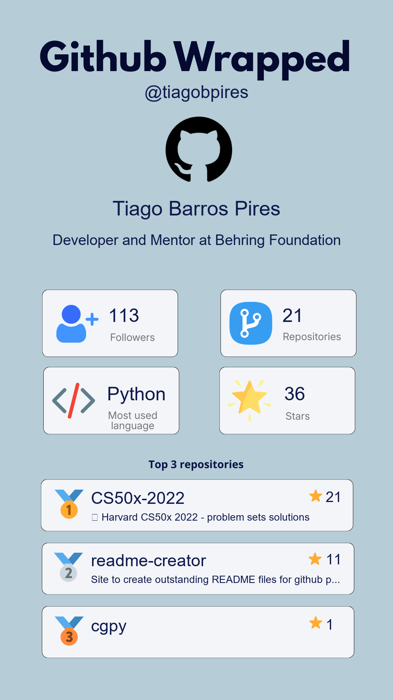

# GitHub Wrapped (Python)

Generate a visual **GitHub Wrapped** card from a GitHub profile, including user stats and top repositories.

## Preview

Example generated image:



## Features

- Fetches public profile data from the GitHub API
- Computes:
  - total stars
  - most used language
  - top 3 repositories by stars
- Generates a wrapped image based on `images/github_wrapped_base.png`
- Supports a local mock run for classroom/demo usage

## Tech Stack

- Python 3.10+
- `requests`
- `Pillow`

## Project Structure

```text
.
|-- main.py
|-- run_example.py
|-- github_client.py
|-- models.py
|-- utils.py
|-- images/
|   |-- github_wrapped_base.png
|   `-- github_wrapped_tiagobpires.png
`-- requirements.txt
```

## Getting Started

### 1. Create and activate a virtual environment

```bash
python -m venv venv
```

Windows (PowerShell):

```bash
.\venv\Scripts\Activate.ps1
```

macOS/Linux:

```bash
source venv/bin/activate
```

### 2. Install dependencies

```bash
pip install -r requirements.txt
```

## Usage

### Option A: Real GitHub user

```bash
python main.py
```

Then enter a GitHub username in the prompt.

### Option B: Demo with mock data

```bash
python run_example.py
```

This generates a sample output without calling the API.

## Output

The generator saves the image as:

```text
images/github_wrapped_<username>.png
```

Example:

```text
images/github_wrapped_tiagobpires.png
```

## How It Works

1. `github_client.py` fetches user and repository data.
2. `utils.py` calculates aggregated stats.
3. `generate_wrapped_image` draws dynamic content on the base template.
4. The final PNG is saved in `images/`.

## Common Issues

- `User not found.`  
  Check if the username is correct and public.

- Font size/position looks off on another machine  
  The code uses system font fallback logic. Adjust sizes in `utils.py` if needed.

- API rate limit errors  
  Retry later or add authenticated requests if needed for heavy usage.

## Educational Notes

This project is intentionally simple and suitable for intermediate Python classes:

- clear separation of concerns (API, models, utils, entrypoints)
- minimal business logic
- practical image rendering with Pillow
